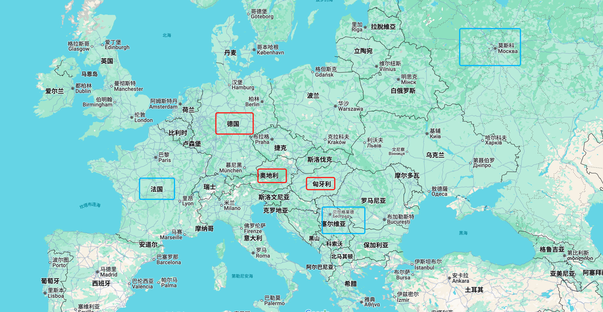

# 第一次世界大战

> 第一次世界大战是**1914年至1918年**之间发生的全球军事冲突。
> 以1914年6月发生的**萨拉热窝事件**作为标志性起点，以1918年11月**德意志帝国**签署停战协议作为结束，战后签署了凡尔赛条约。
> 总体上战争由两大阵营参与 **协约国**：英法俄； **同盟国**：德、奥匈帝国、奥斯曼帝国。
> 至少动员了**6700万人**参与这场战争  <small>此时世界人口总数大概在17亿左右</small>

---

## 纲要

* 战争的发生
* 战争的进程
* 战争的影响

---

## 战争的发生

* **战争是如何爆发的**

  > 十九世纪以来斯拉夫民族普遍处于德国，奥匈，奥斯曼帝国的压迫之下。
  > 随着民族主义在欧洲的蔓延，南斯拉夫人对共同身份的渴望日益增强，民族意识逐步觉醒。以南斯拉夫民族为主体的塞尔维亚，作为少数实现独立的斯拉夫国家，开始积极参与南欧的斯拉夫运动。
  > 在波黑，青年波斯尼亚党等组织在反奥情绪与塞尔维亚支持下迅速激进，民族矛盾不断加深。最终，极端民族主义走向暴力，以萨拉热窝的刺杀事件引爆政治危机

  * **萨拉热窝事件**
    
    * 1914年6月28日 奥匈帝国皇储斐迪南大公，在萨拉热窝被青年波斯尼亚党的成员刺杀身亡
    
    * 7月5日 德国向奥匈帝国明确表示支持，无论奥匈帝国做出什么动作，德国都将无条件支持
    
      > 1871年完成统一的德意志帝国，面临“东有沙俄，西有法国”的地缘政治压力。为避免两线作战，德国确定了“联合奥匈，抵抗法俄” 的方针。
      > 在斐迪南遇刺之后，德国为维护同盟体系和遏制斯拉夫主义，向奥匈发出“空白支票”，
      > 即"无条件支持其对塞尔维亚的任何行动"。 德皇威廉二世的冲动性格亦推动了这一决策。
      > 德国的表态坚定了奥匈采取军事手段解决危机的决心，激化了奥匈帝国与塞尔维亚的矛盾。
    
    * 7月23日 奥匈帝国向塞尔维亚发出“最后通牒”，包含十项条件。
      7月25日 萨尔维亚回复了“最后通牒”，同意了大部份条件，但拒绝了少数条件。
    
      > 通牒中的个别条件尤为苛刻，如：要求塞尔维亚允许奥匈帝国的官员进入境内调查刺杀事件。
    
    * 7月28日 奥匈帝国对塞尔维亚宣战。局部冲突正式开始

* **战争是如何失控的**

  > 如何从局部战争变成全球战争的
  
  * 7月29日-30日：俄国部分/全面动员 （连锁反应开始）
  
    > 面对奥匈对塞尔维亚的宣战，沙俄率先进行战争动员。
    > 这一决策源于三重动力的交织作用：一方面，作为最强大的斯拉夫民族国家，沙俄一直自诩为斯拉夫人的保护者和老大哥。若放任奥匈帝国对塞尔维亚的进攻，将动摇沙俄在巴尔干的影响力和领袖地位；另一方面，沙俄国内矛盾日渐加深，沙皇的专制统治正岌岌可危。高层和军方认为，一场对外战争可以转移国内矛盾并巩固沙皇统治；同时，军方认为沙俄幅员辽阔，越快进行战争动员，越早对敌人进行军事打击，越能占据上风。在地缘责任、国内压力与军事判断的共同驱动下，沙俄选择了军事动员。这场巴尔干半岛上的战火开始逐步蔓延到全欧洲。
  
  * 8月1日：德国对俄国宣战；法国开始军事动员；
  
    > 在1914年的战争文化中，谁先出击谁就占据了战略上风。为了先发制人，德国在沙俄战争动员后，就立即对沙俄宣战。
    > 对德国而言，为避免陷入法俄两线作战的僵局，德国决定执行“施里芬计划”，先攻法国、后战俄国。
    > 随着局势紧张，法国基于与沙俄的同盟义务和应对德国进攻的预期，也启动了战争动员
  
  * 8月3日：德国对法国宣战；并由于比利时不同意德国借道入侵法国，德国入侵比利时
  
    > 德国按照施里芬计划进行进攻，准备先进攻法国。
    > 为了避开法国东部的严密防守，德国打算借道比利时，从法国东北部进攻。
    > 比利时拒绝了德国的借道请求，德国随即入侵卢森堡和比利时。
  
  * 8月4日：英国对德国宣战
  
    > 在1839年签订的伦敦条约中，欧洲列强约定比利时为永久中立国。德国入侵比利时不仅违反了伦敦条约，并且直接威胁到了与比利时隔海相望的英伦三岛的安全。于是为了遏制德国称霸欧洲，英国随即对德国宣战。

---

## 战争的进程

* **战火初燃 (1914年):** 战争爆发初期，各国怀揣速决战的幻想，战火迅速蔓延
  西线战事激烈，但很快在马恩河战役后陷入僵局，双方开始挖掘战壕。东线则以大规模的机动战为主。
  西线从运动战逐步转向了“堑壕战”，数百万士兵在战壕中对峙，伤亡惨重。

* **僵持 (1915-1916年):**  西线陷入堑壕战，双方陷入旷日持久、消耗巨大的僵持阶段
  战线进入全面僵持，尤其是西线，双方试图通过大规模攻势（如凡尔登战役、索姆河战役）突破对方防线，但往往只带来巨大伤亡而进展甚微。这是一场残酷的消耗战，拼的是资源和人命。
  * 凡尔登战役
    凡尔登战役是第一次世界大战中破坏性最大、时间最长的战役之一，双方伤亡人数总计约100万人

* **变局 (1917年):**   沙俄退出和美国参战这两大决定性事件对战争格局的产生根本性改变
  * 沙俄退出协约国
    第一次世界大战给沙俄的国内形势造成了巨大的打击。长期战争使国家经济濒临崩溃：前线伤亡惨重，后方物资短缺，通货膨胀，民众生活困难。并且沙皇尼古拉二世平庸无能，指挥作战连连失利，加之后方政府腐败严重，沙皇统治危在旦夕。
    在政治高压和社会动荡中，1917年2月圣彼得堡爆发了大规模的工人和农民革命运动，沙皇派去镇压的军队也倒戈加入革命。在人民和军队的压力下，俄皇宣布退位。
    随后，沙俄经历了资产阶级临时政府和苏维埃政权。在苏维埃政权的领导下，为响应人民的厌战情绪，在1918年3月，苏维埃正式和德国达成协约，宣布退出第一次世界大战。这一退出使德国得以将东线大量兵力调往西线，成为战局的重大转折点之一
  * 美国参战
    美国在一战初期奉行中立主义，没有直接参与作战，而是通过向协约国提供贷款和出售物质，在经济层面上参与战争。
    随着战争发展，德国实行无限制潜艇战，直接影响了美国的民间贸易，导致了美国人员和财产的损失。与此同时，由于齐默尔曼电报的披露，美国人发现德国在密谋“如若美国参战，将协助墨西哥收回失地”。这两件事情都大大激起了美国民众的愤慨。
    1917年4月6日美国对德国宣战。同年晚些时候，美国军队抵达欧洲，并参与了西线战场的主要作战行动，尤其是战争末期的百日攻势。

* **溃败 (1918年):**  同盟国在协约国反攻下节节败退，最终全面崩溃并签署停战协议
  1918年8月8日，协约国在法国亚眠发动亚眠战役，标志着百日攻势的开始；在往后的三个月内，协约国又多次在西方战线上对同盟国防线实施了一系列攻势，迫使其一路撤退至兴登堡防线内。
  11月11日，同盟国军队无力再战，被迫投降，双方在法国北部城市贡比涅附近的森林中签署了《康边停战协定》，第一次世界大战正式结束。

---

## 战争的影响

* **政治格局**
  一战导致了德意志，奥匈帝国，奥斯曼帝国，沙俄的彻底瓦解。战胜国在巴黎和会（1919年）上确立了战后国际秩序，形成凡尔赛体系。核心是惩罚德国的《凡尔赛条约》，以及通过国际联盟来维护和平。
* **经济**
  欧洲各主要参战国（包括战胜国英、法、意和战败国德、奥匈）在战争中耗尽了大量人力、物力、财力，背负了巨额战争债务。许多工业区和农业区遭到破坏，生产力严重下降。战后欧洲的经济重建缓慢而艰难。
  与此同时，美国作为主要贷款国和物资供应国，在战争期间向协约国提供了大量物资和巨额贷款，经济实现了空前繁荣。日本趁欧洲无暇顾及远东地区，大肆扩张亚太地区的势力范围，侵占德国在华权益。日本工业生产和海外贸易大幅增长，成为亚洲唯一的帝国主义强国。
* **社会文化**
  * **战争创伤**
    战争造成了数千万人的死亡和伤残，许多家庭失去了父亲、儿子、兄弟。这种规模的牺牲是前所未有的，也让人们对战争的“荣耀”和“英雄主义”产生了巨大的幻灭。许多人通过文学、艺术等形式，揭露战争的残酷和荒谬，表达对战争的反感和厌恶。
  * **女性定位提升**
    战争导致大量男性伤亡，工厂和农场急需劳动力，使得女性大规模进入传统上由男性主导的领域。这改变了社会对女性角色的认知，并在战后推动了女性获得选举权等政治权利的进程。

